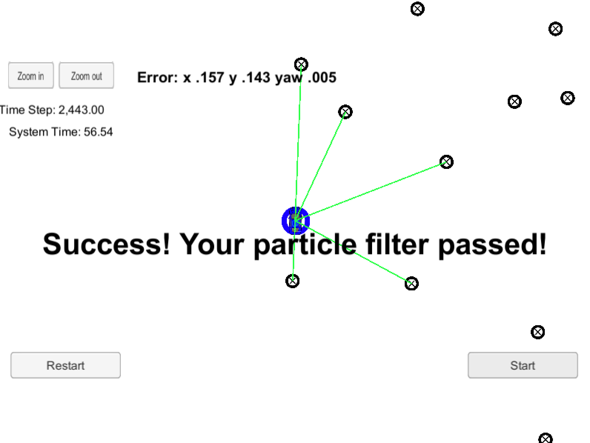

# CarND-Kidnapped-Vehicle-Project

In this project we implemented a particle filter to localize a moving vehicle.

## Particle Filter Algorithm:

The steps of particle filter includes:
- Initialize the initial localtion using GPS info. I chose to use `10` particles around the initial GPS location. Those particles are randomly sampled through Gaussian with GPS uncertainty.
- Predict the motion for all particles. We use `constant turn rate and velocity magnitude` model. Please note the process function when `yaw_rate = 0.0`;
- Landmark-Observation Association. For each particle, we need convert the observation from vehicle cooirdinate system to global map coordinate system. Then we find matched landmark for each observation using `nearest neighbour` algorithm.
- Then, we calculate the weight for each particle using mult-variate Gaussian distribution, applying to each landmark and observation pair.
- Using resample algorithm to get new particles using their weight.

## Result

The final code passed the project test.

  
   
  <em>Figure 1: Final Result</em>

